# FP-TKA

## I. Introduction
Anda adalah seorang lulusan Teknologi Informasi, sebagai ahli IT, salah satu kemampuan yang harus dimiliki adalah Keampuan merancang, membangun, mengelola aplikasi berbasis komputer menggunakan layanan awan untuk memenuhi kebutuhan organisasi.(menurut kurikulum IT ITS 2023 😙)

Pada suatu saat teman anda ingin mengajak anda memulai bisnis di bidang digital marketing, anda diberikan sebuah aplikasi berbasis API

Kemudian anda diminta untuk mendesain arsitektur cloud yang sesuai dengan kebutuhan aplikasi tersebut. Apabila dana maksimal yang diberikan adalah 1 juta rupiah per bulan (65 US$) konfigurasi cloud terbaik seperti apa yang bisa dibuat?

Pada final project TKA ini, diminta untuk merancang arsitektur cloud untuk deploy aplikasi. Diberikan pilihan lingkungan cloud yakni menggunakan Digital Ocean, Microsoft Azure, dan Local Virtual Machine dan kami memutuskan untuk menggunakan Microsoft Azure. Setelah itu, diminta untuk mendeploy aplikasi dan mengetes load balancing menggunakan locust. Kita diminta untuk mendesain arsitektur cloud yang hemat biaya untuk aplikasi berbasis API yang akan digunakan untuk bisnis digital marketing.

## II. Rancangan Arsitektur Komputasi Awan dan Spesifikasi
- Rancangan arsitektur
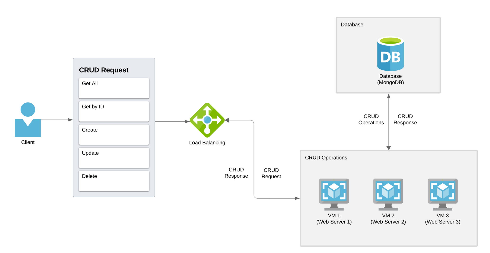

- Tabel spesifikasi
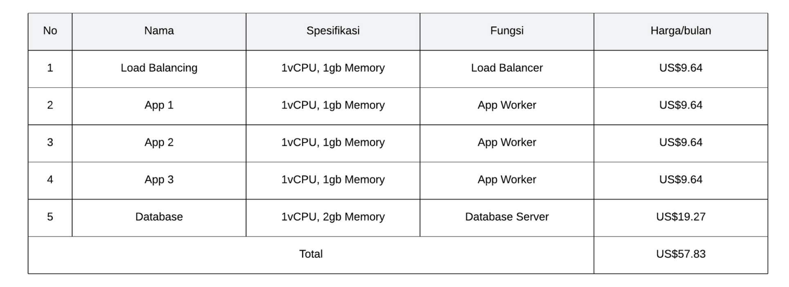

## III. Langkah-langkah Implementasi dan Konfigurasi
1. Membuat Database dan connection string
 
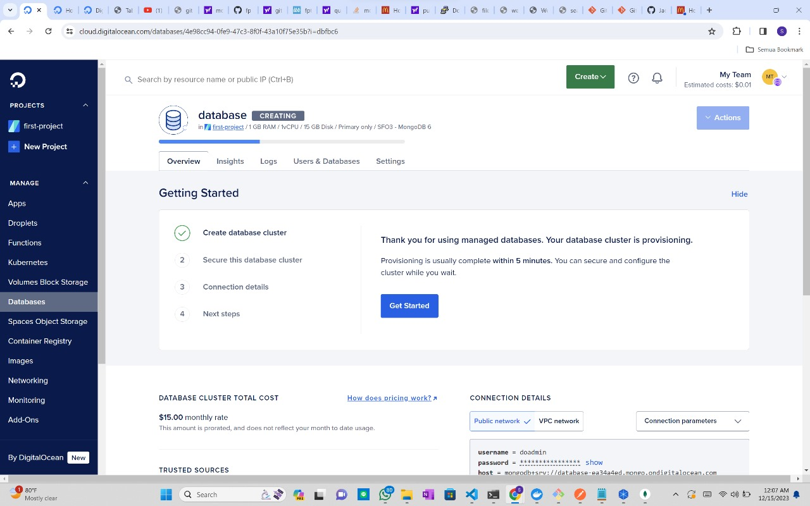
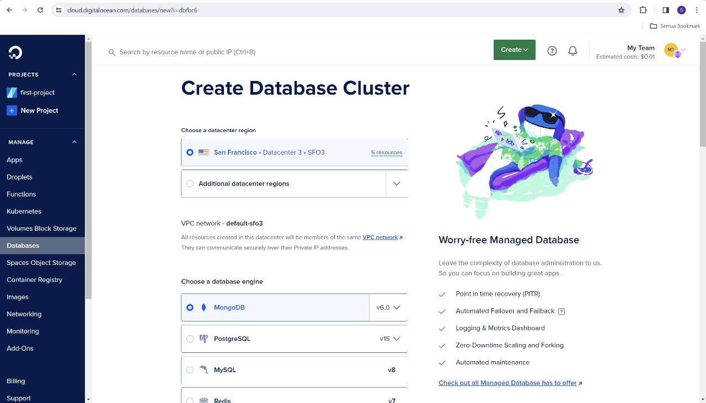
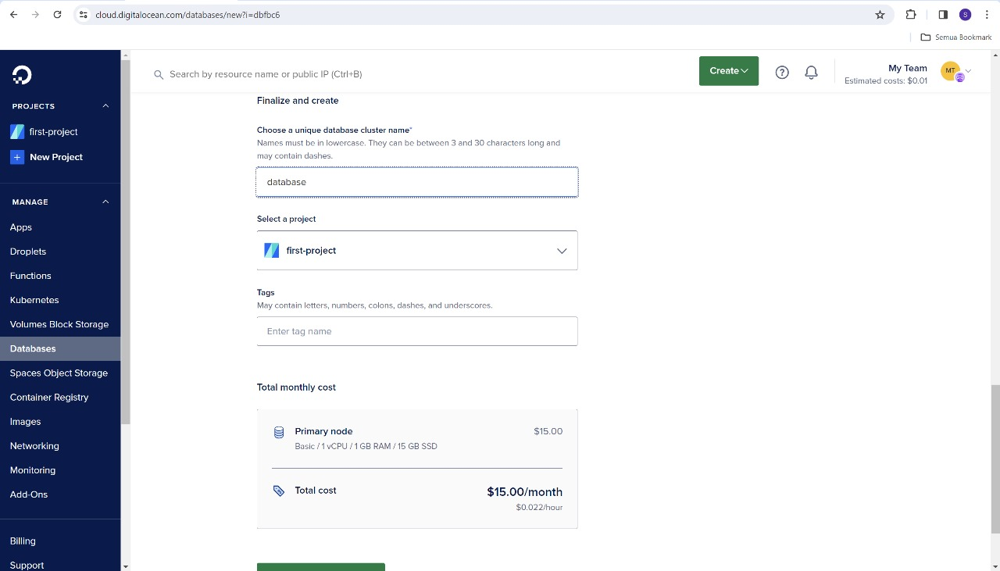

2. Create ‘New Connection’ dengan string database yang sudah ada sebelumnya, dan buat database sesuai dengan variabel yang sudah dibuat di dalam app.py

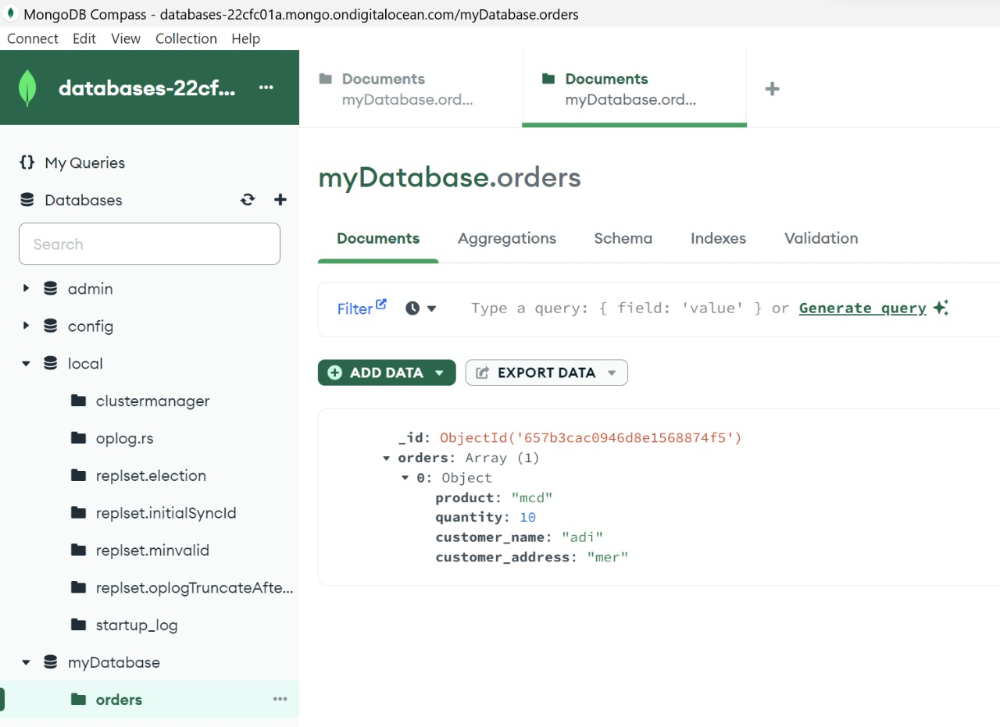
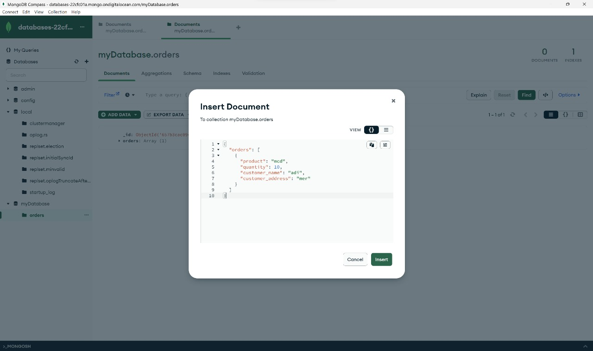

## IV. Hasil Pengujian Endpoint setiap API
- 1. Get All Orders
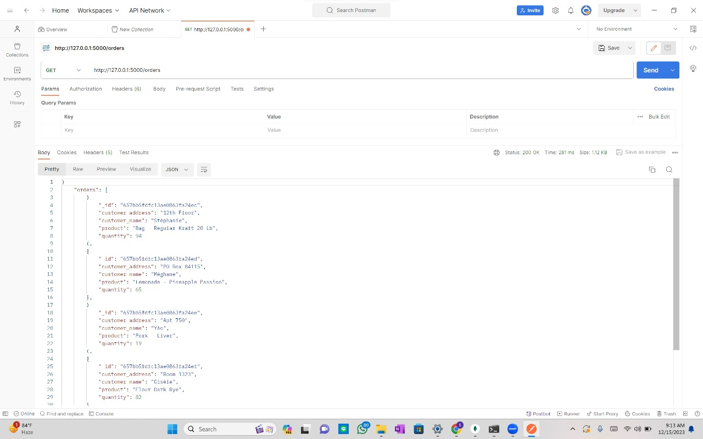

- 2. Get a Specific Order by ID
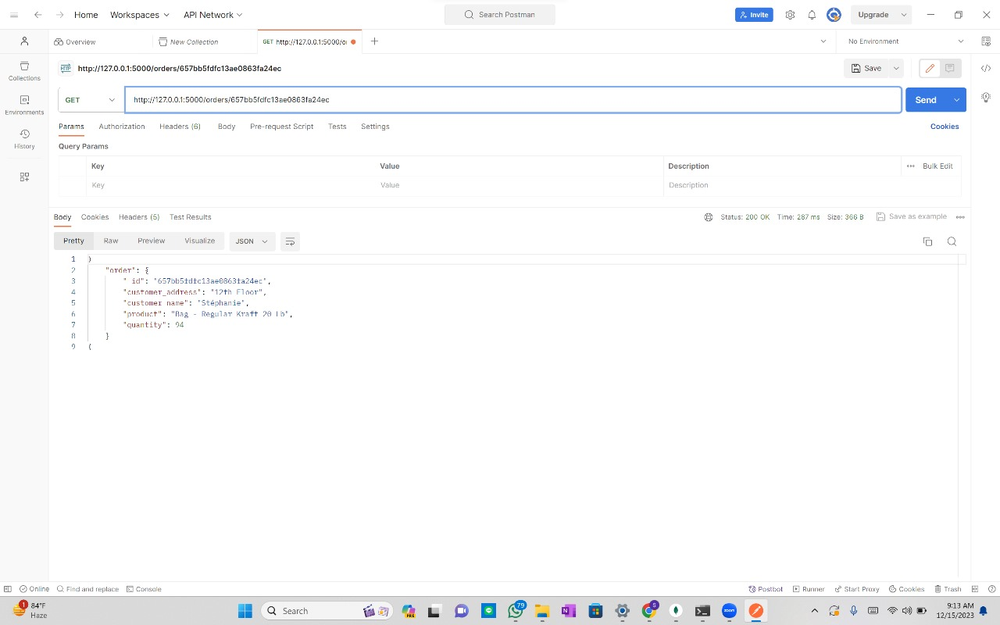

- 3. Create a New Order
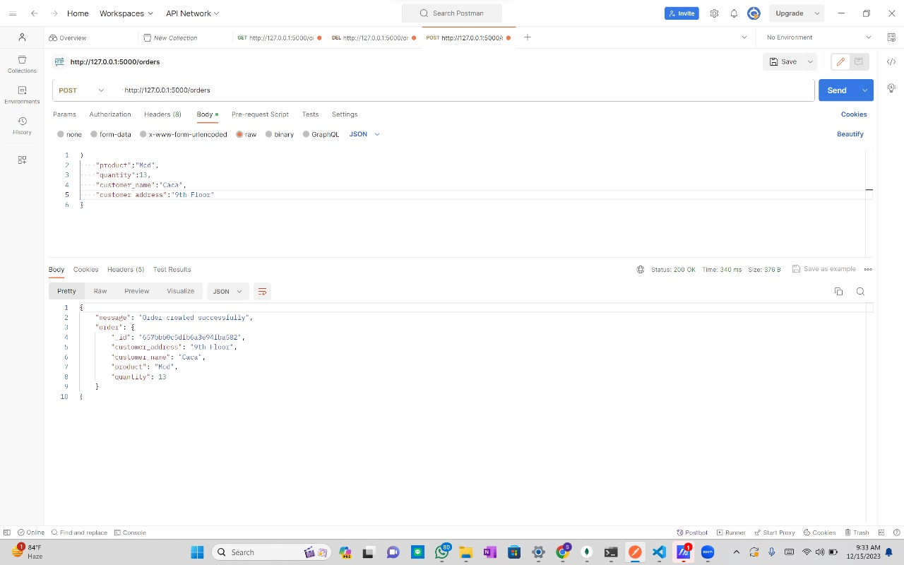

- 4. Update an Order by ID
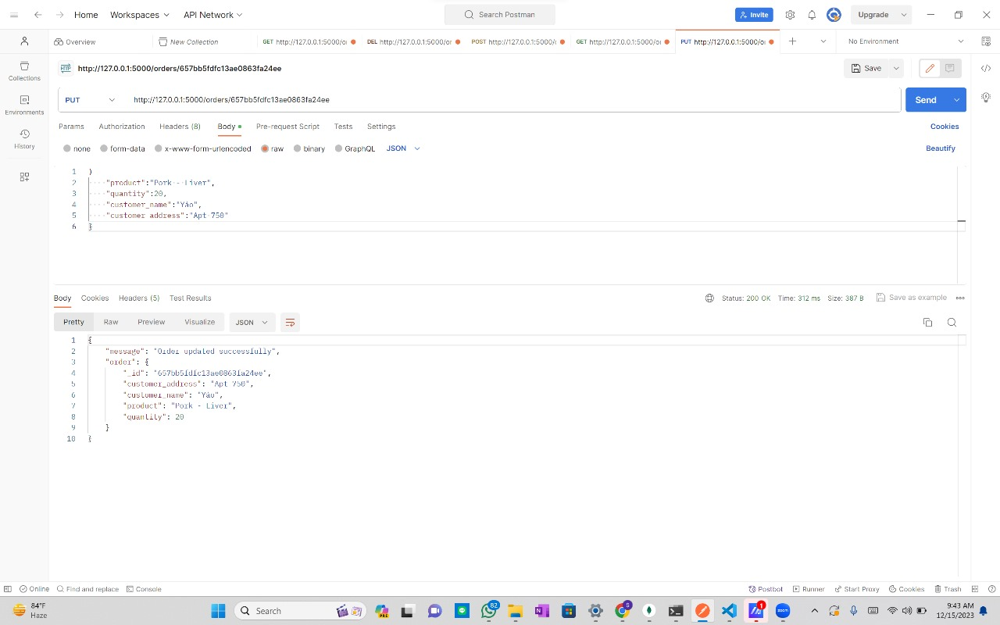

- 5. Delete an Order by ID
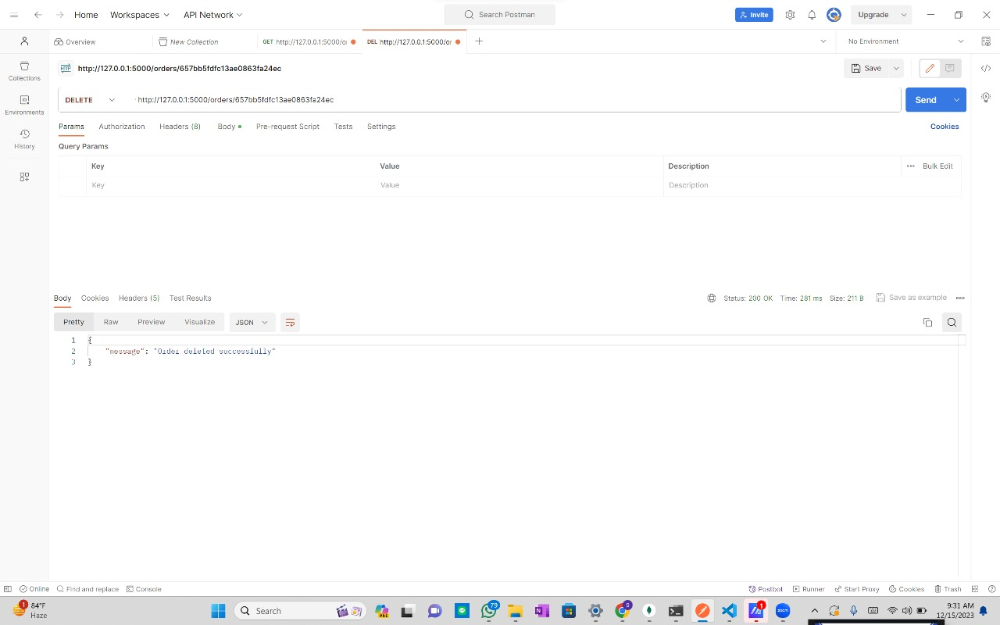

## V. Hasil Pengujian dan Analisis Loadtesting Menggunakan Locust
- 1. Jumlah Request per seconds (RPS)

- 2. Jumlah peak concurrency maksimum yang dapat ditangani oleh server dengan spawn rate 25 dan durasi waktu load testing 60 detik

- 3. Jumlah peak concurrency maksimum yang dapat ditangani oleh server dengan spawn rate 50 dan durasi waktu load testing 60 detik

- 4. Jumlah peak concurrency maksimum yang dapat ditangani oleh server dengan spawn rate 100 dan durasi waktu load testing 60 detik

## VI. Kesimpulan dan saran.
Setelah percobaan yang kami lakukan berulang kali, jumlah load balancer sebaiknya sama dengan jumlah worker karena ketika kami mencoba menggunakan 1 load balancer dan 3 worker terjadi down pada ketiga worker tersebut
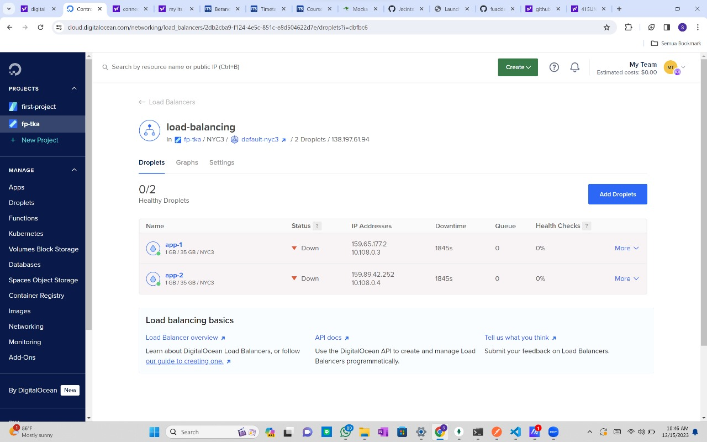

## Problems
- Load balancer masih dalam kondisi failure.
  Dampak: Load balancer tidak dapat berfungsi sebagai pengatur lalu lintas ke backend server. Hal ini menyebabkan backend server tidak dapat diakses.
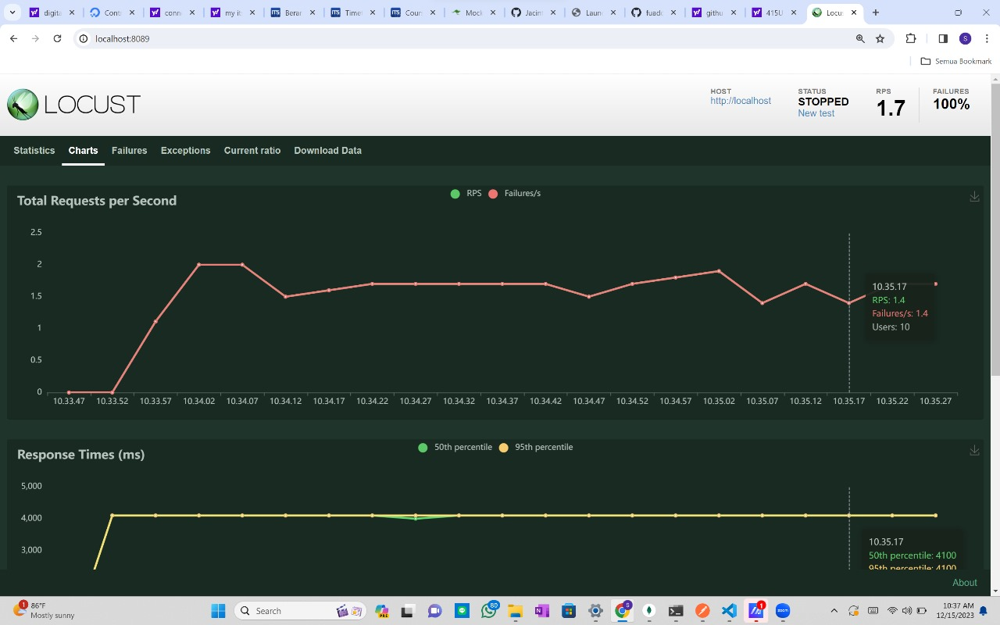
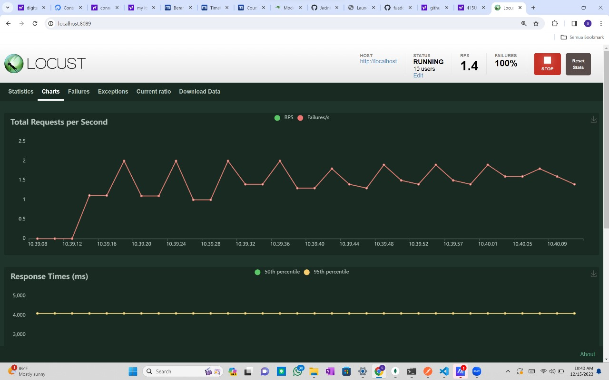

- Load balancer masih dalam kondisi down.
Penyebab down load balancer belum diketahui secara pasti. Load balancer telah dikonfigurasi ulang dengan jumlah worker yang berbeda, yaitu 2 dan 3 worker. Namun, load balancer tetap down.

