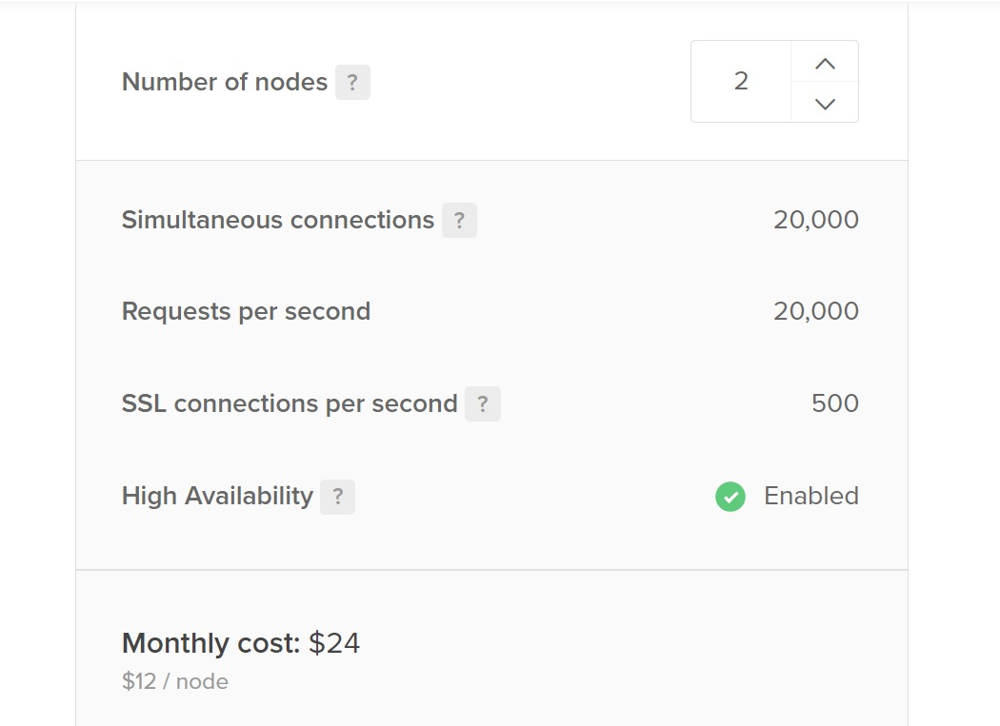
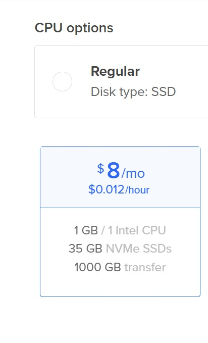
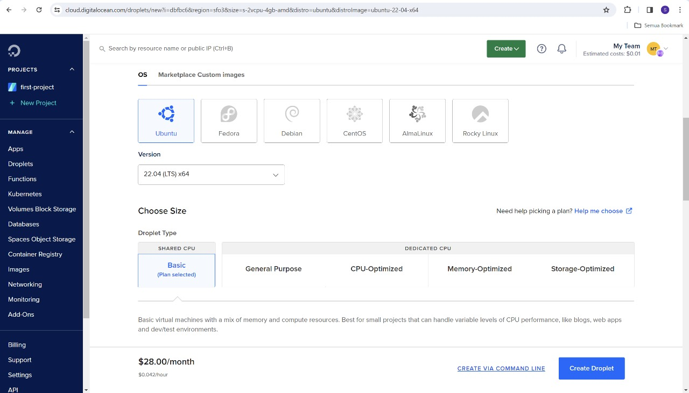
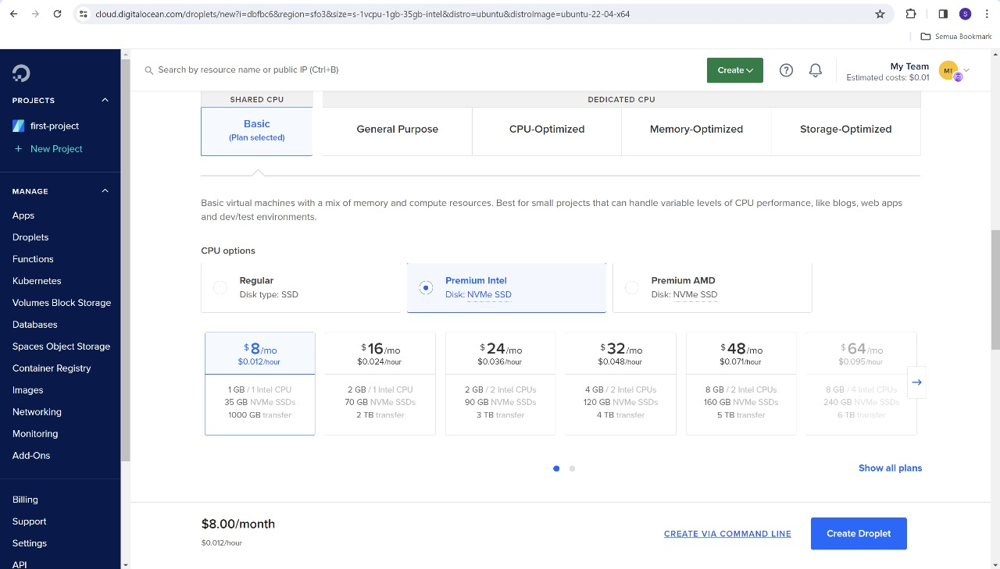
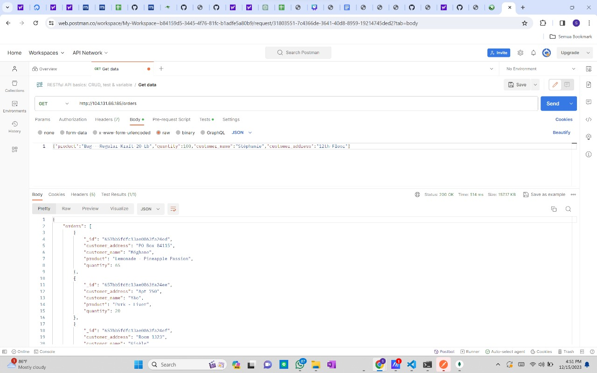
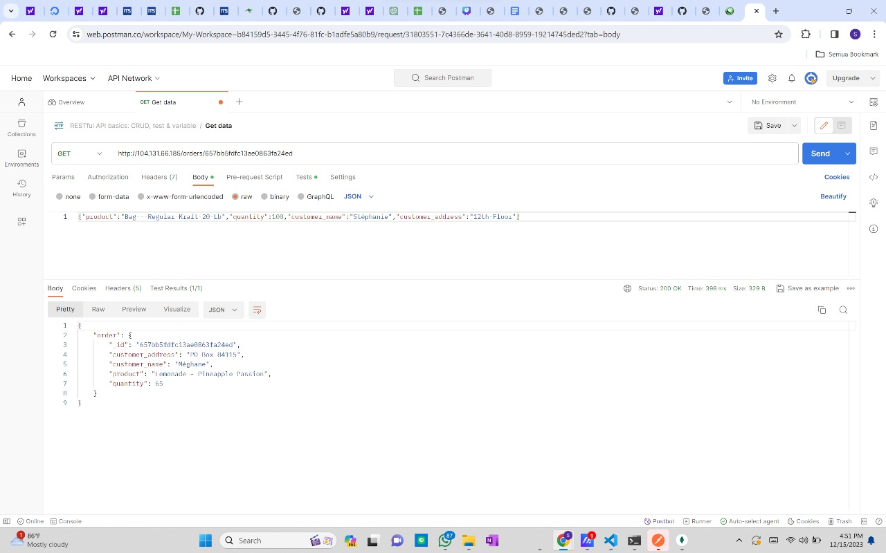
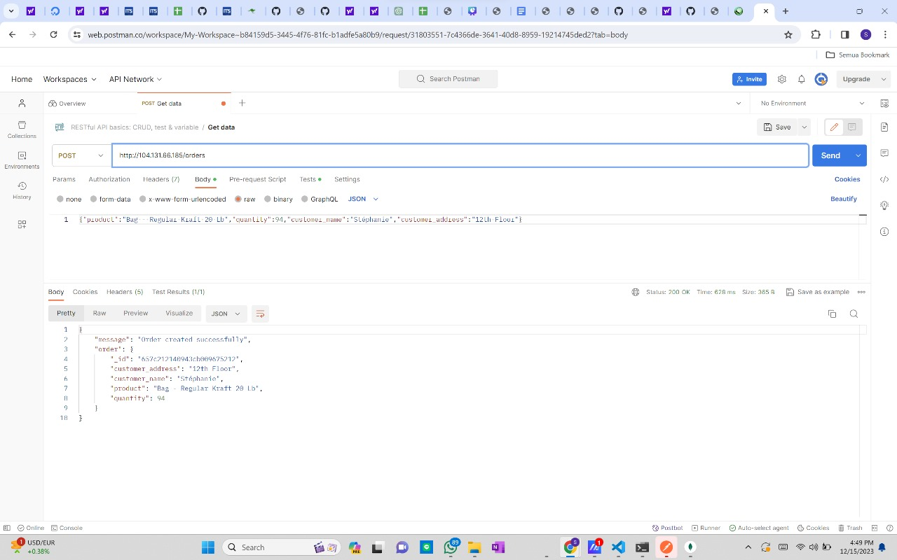
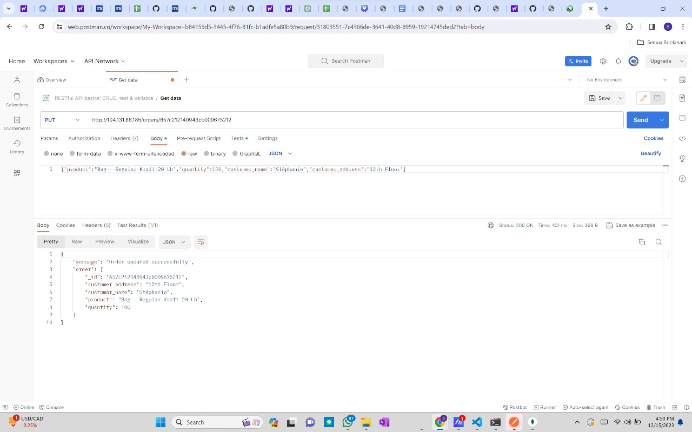
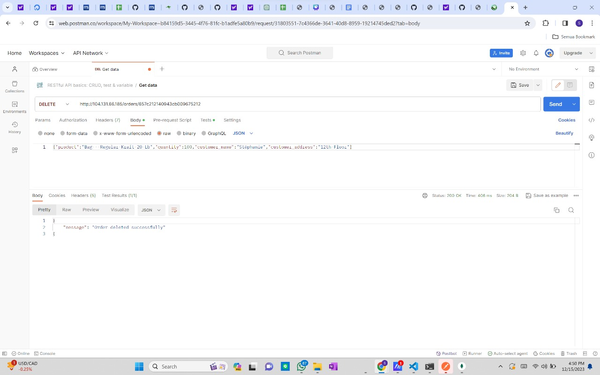
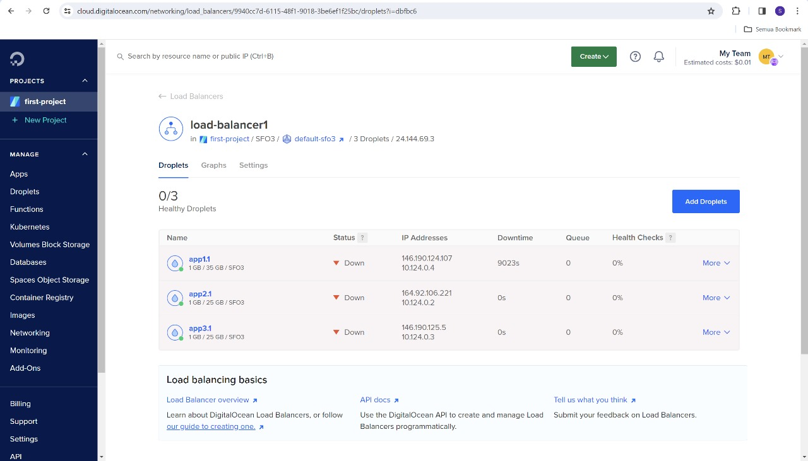

# Laporan Final Project TKA

## Kelompok 3 Kelas B
| Nama             | NRP        |
|------------------|------------|
| Sylvia Febrianti | 5027221019 |
| Steven Figo      | 5027221021 |
| Salsabila Amalia | 5027221023 |
| M. Faishal R.    | 5027221026 |
| Samuel Yuma      | 5027221029 |

## I. Introduction
Anda adalah seorang lulusan Teknologi Informasi, sebagai ahli IT, salah satu kemampuan yang harus dimiliki adalah Keampuan merancang, membangun, mengelola aplikasi berbasis komputer menggunakan layanan awan untuk memenuhi kebutuhan organisasi.(menurut kurikulum IT ITS 2023 😙)

Pada suatu saat teman anda ingin mengajak anda memulai bisnis di bidang digital marketing, anda diberikan sebuah aplikasi berbasis API

Kemudian anda diminta untuk mendesain arsitektur cloud yang sesuai dengan kebutuhan aplikasi tersebut. Apabila dana maksimal yang diberikan adalah 1 juta rupiah per bulan (65 US$) konfigurasi cloud terbaik seperti apa yang bisa dibuat?

Pada final project TKA ini, diminta untuk merancang arsitektur cloud untuk deploy aplikasi. Diberikan pilihan lingkungan cloud yakni menggunakan Digital Ocean, Microsoft Azure, dan Local Virtual Machine dan kami memutuskan untuk menggunakan Microsoft Azure. Setelah itu, diminta untuk mendeploy aplikasi dan mengetes load balancing menggunakan locust. Kita diminta untuk mendesain arsitektur cloud yang hemat biaya untuk aplikasi berbasis API yang akan digunakan untuk bisnis digital marketing.

## II. Rancangan Arsitektur Komputasi Awan dan Spesifikasi
### Rancangan arsitektur

### Tabel spesifikasi
- load balancer

- worker

- database

- Tabel

Tabel Berikut adalah tabel spesifikasi.

| No. | Nama           | Spesifikasi       | Fungsi        | Harga/bulan |
|-----|----------------|-------------------|---------------|-------------|
| 1   | Load Balancing | 1vCPU, 1GB Memory | Load Balancer | $24 USD     |
| 2   | App 1          | 1vCPU, 1GB Memory | App Worker    | $8 USD      |
| 3   | App 2          | 1vCPU, 1GB Memory | App Worker    | $8 USD      |
| 4   | Database       | 1vCPU, 1GB Memory | Database      | $15 USD     |

## III. Langkah-langkah Implementasi dan Konfigurasi

1. Membuat droplet baru, mesin virtual yang digunakan untuk menjalankan aplikasi di cloud

3. Membuat Database dan connection string
 

3. Create ‘New Connection’ dengan string database yang sudah ada sebelumnya, dan buat database sesuai dengan variabel yang sudah dibuat di dalam app.py

## IV. Hasil Pengujian Endpoint setiap API
- 1. Get All Orders

- 2. Get a Specific Order by ID

- 3. Create a New Order

- 4. Update an Order by ID

- 5. Delete an Order by ID

## V. Hasil Pengujian dan Analisis Loadtesting Menggunakan Locust

- Jumlah Request per seconds (RPS) dan Jumlah peak concurrency maksimum yang dapat ditangani oleh server dengan spawn rate 25, 50, dan 100 untuk durasi waktu load testing 60 detik V.2

Untuk poin ini, dikarenakan terkendala load balancer yang down, maka pengujian locust tidak memungkinkan

## VI. Kesimpulan dan saran.
Cloud computing dapat membantu pengguna untuk menghemat biaya, meningkatkan efisiensi, dan meningkatkan ketersediaan aplikasi dan layanan mereka.
Setelah melakukan pengecekan harga, harga untuk Digital Ocean lebih murah dibandingkan dengan Microsoft Azure. Sehingga dengan budget $65/bulan sebenarnya sudah dapat mendeploy aplikasi. Dalam hal ini dilakukan konfigurasi satu load balancer, dua worker app, dan satu database yang masing masing memiliki spesifikasi 1vCPU dan 1GB memory. Dengan konfigurasi tersebut, didapat harga $55/bulan.

## Problems
- Load balancer masih dalam kondisi failure.
  Dampak: Load balancer tidak dapat berfungsi sebagai pengatur lalu lintas ke backend server. Hal ini menyebabkan backend server tidak dapat diakses.

- Load balancer masih dalam kondisi down.
Penyebab down load balancer belum diketahui secara pasti. Load balancer telah dikonfigurasi ulang dengan jumlah worker yang berbeda, yaitu 2 dan 3 worker. Namun, load balancer tetap down.

