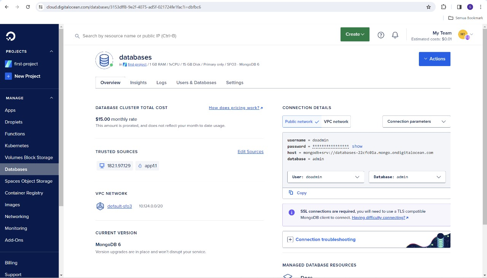

# FP-TKA

## I. Introduction
Pada final project TKA ini, diminta untuk merancang arsitektur cloud untuk deploy aplikasi. Diberikan pilihan lingkungan cloud yakni menggunakan Digital Ocean, Microsoft Azure, dan Local Virtual Machine dan kami memutuskan untuk menggunakan Microsoft Azure. Setelah itu, diminta untuk mendeploy aplikasi dan mengetes load balancing menggunakan locust.

## II. Rancangan Arsitektur Komputasi Awan dan Spesifikasi
- Rancangan arsitektur

- Tabel spesifikasi

## III. Langkah-langkah Implementasi dan Konfigurasi
1. Membuat Database dan connection string
 

2. Create ‘New Connection’ dengan string database yang sudah ada sebelumnya, dan buat database sesuai dengan variabel yang sudah dibuat di dalam app.py

## IV. Hasil Pengujian Endpoint setiap API
- 1. Get All Orders

- 2. Get a Specific Order by ID

- 3. Create a New Order

- 4. Update an Order by ID

- 5. Delete an Order by ID

## V. Hasil Pengujian dan Analisis Loadtesting Menggunakan Locust
- 1. Jumlah Request per seconds (RPS)

- 2. Jumlah peak concurrency maksimum yang dapat ditangani oleh server dengan spawn rate 25 dan durasi waktu load testing 60 detik

- 3. Jumlah peak concurrency maksimum yang dapat ditangani oleh server dengan spawn rate 50 dan durasi waktu load testing 60 detik

- 4. Jumlah peak concurrency maksimum yang dapat ditangani oleh server dengan spawn rate 100 dan durasi waktu load testing 60 detik

## VI. Kesimpulan dan saran.
